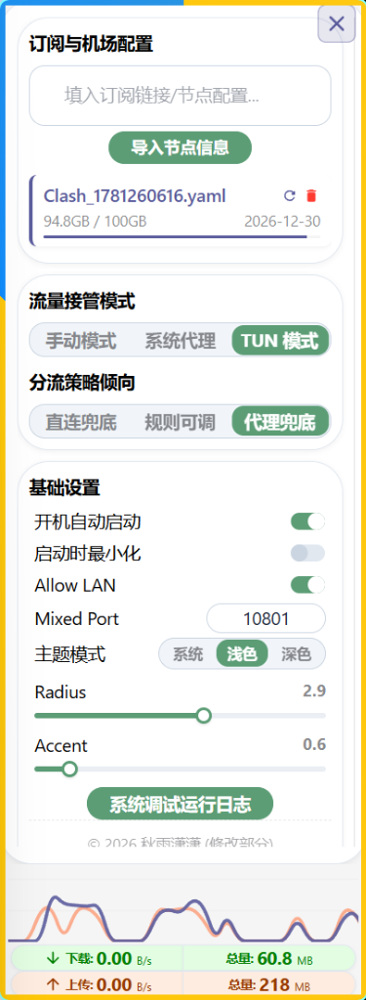
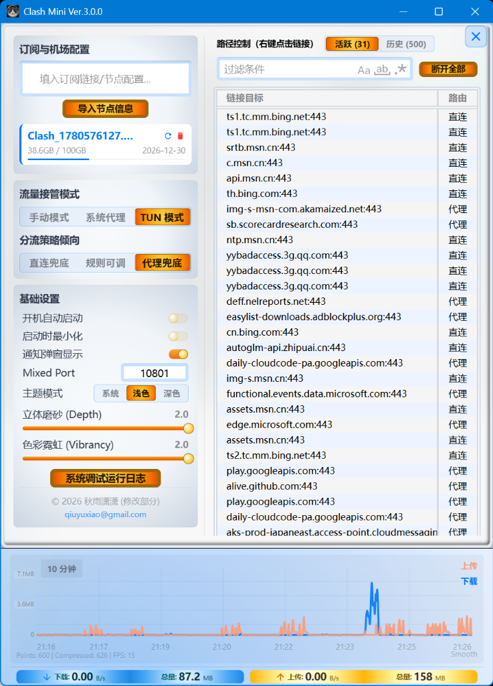

# Clash Mini

Clash Mini is a customized enhancement of **Clash Verge**, optimized for tailored workflows, enhanced 3D visual styles, and performance.

---

## Quick Start Guide (用户必读)

> **宗旨**：极简，零门槛，开箱即用，为小白首选。

### 一步入门 (Getting Started)
点击 Clash Mini 右上角【齿轮】按钮，将任意格式（共支持 19 种协议）的订阅链接/节点配置【填入订阅链接/节点配置】并点击【导入节点信息】后等待代理节点被激活。

### 客户端代理配置 (Client Configuration)
* **浏览器**：导入节点后已可直接开始科学上网。
* **其他客户端软件**：大部分已可直接科学上网。少数无法科学上网的，可手动将其代理地址设置为 `127.0.0.1`，端口 `10801`。
* **全局代理**：若软件无手动配置代理功能，请开启 Clash Mini 的 **TUN 模式**。

> [!NOTE]
> **什么是【TUN 模式】？**
> 建立系统虚拟网卡全盘接管全机流量。适合外服游戏、命令行窗口以及其他无视系统代理的软件。
> *注意：TUN 模式占用系统资源大且易产生冲突。若无上述特定需求无须开启，使用 Clash Mini 默认设置即可。*

### 特色功能 (Key Features)
* **【自动连切】**：导入或切换订阅链接后自动开始测速并切换至最快节点；运行中自动回避拥堵及故障节点。测速与切换可仅针对当前筛选出的节点集执行，规避某些软件的地域限制。
* **【规则更新】**：集成了主流规则集和地理数据库并保持自动同步更新。
* **【微缩监控】**：将窗口调整为最小尺寸，程序就化身为科学流量计。
* **【右键分流 (小白止步)】**：右键点击【路径控制】列表中的链接，可一键选择直连、代理或拒绝，手动生成最高优先级分流规则（使用此功能时需将程序窗口最大化）。

---

## Visual Showcase

### 1. Micro-Monitoring Mode (流量监控模式)

  

### 2. Node List in Narrow Layout (窄窗口模式 节点列表)

  

### 3. Settings Panels (窄窗口模式 设定选项)
* **Dark Theme (深色主题 - 专家级选项)**:
   
  
* **Light Theme (浅色主题 - 小白设定选项)**:
   
  

### 4. Expert Mode Layouts (宽窗口专家模式)
* **Dark Theme (深色主题)**:
   
  
* **Light Theme (浅色主题)**:
   
  

---

## Copyright and Licensing

- **Upstream Project**: Clash Mini is a derivative work based on [Clash Verge](https://github.com/clash-verge-rev/clash-verge-rev). We respect and acknowledge the copyright of the original authors of Clash Verge.
- **Custom Portions**: Copyright (c) 2026 秋雨潇潇 <qiuyuxiao@gmail.com>. All rights reserved. (Only applies to custom modifications, style adaptations, and visual layouts introduced in this custom version).
- **License**: The entire project is licensed under the GNU General Public License v3.0 (GPL-3.0-only). See [LICENSE](LICENSE) for details.

## Development and Contributions

See [CONTRIBUTING.md](CONTRIBUTING.md) for details on setting up the environment and contributing code.
