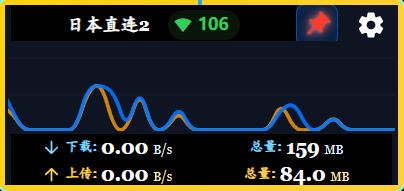
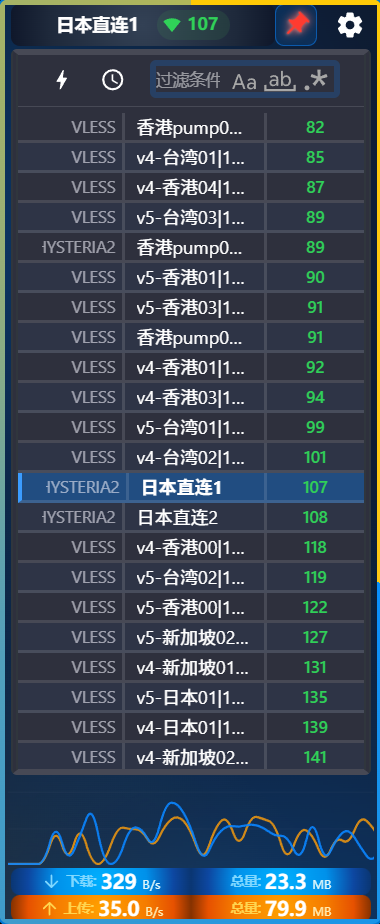
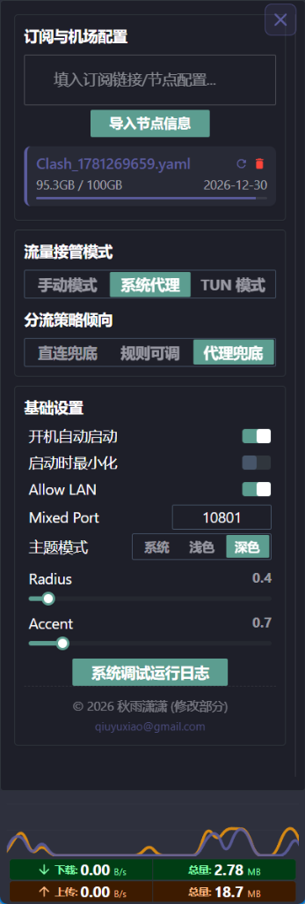
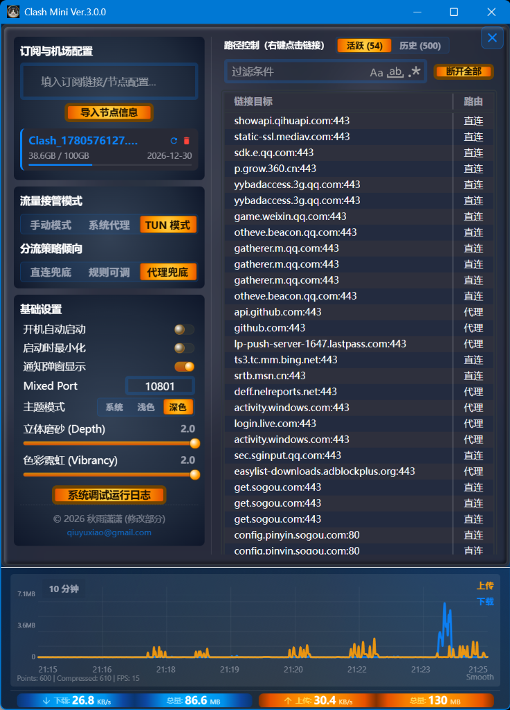

# Clash Mini

Clash Mini is a customized enhancement of **Clash Verge**, optimized for tailored workflows, enhanced 3D visual styles, and performance.

## Visual Showcase

### 1. Micro-Monitoring Mode (流量监控模式)

  

### 2. Node List in Narrow Layout (窄窗口模式 节点列表)

  

### 3. Settings Panel with Copyright Footer (窄窗口模式 设定页面)

  

### 4. Expert Mode with Dark Theme (专家模式 深色主题)

  

---

## Copyright and Licensing

- **Upstream Project**: Clash Mini is a derivative work based on [Clash Verge](https://github.com/clash-verge-rev/clash-verge-rev). We respect and acknowledge the copyright of the original authors of Clash Verge.
- **Custom Portions**: Copyright (c) 2026 秋雨潇潇 <qiuyuxiao@gmail.com>. All rights reserved. (Only applies to custom modifications, style adaptations, and visual layouts introduced in this custom version).
- **License**: The entire project is licensed under the GNU General Public License v3.0 (GPL-3.0-only). See [LICENSE](LICENSE) for details.

## Development and Contributions

See [CONTRIBUTING.md](CONTRIBUTING.md) for details on setting up the environment and contributing code.
