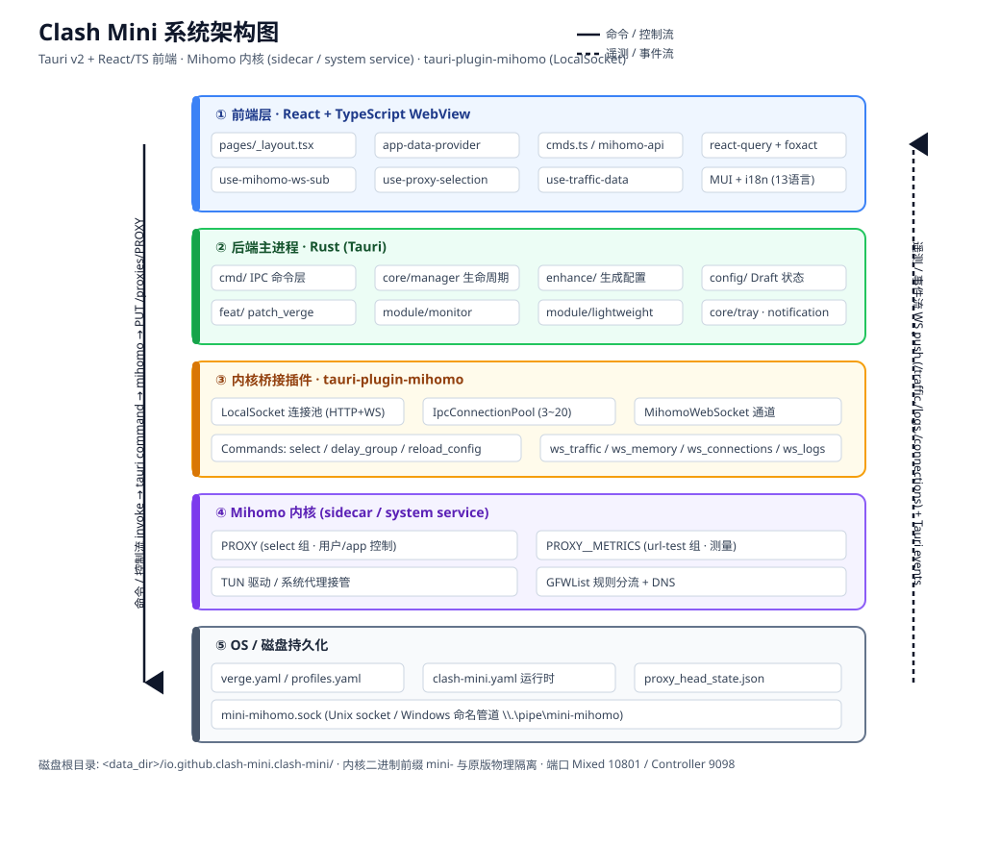
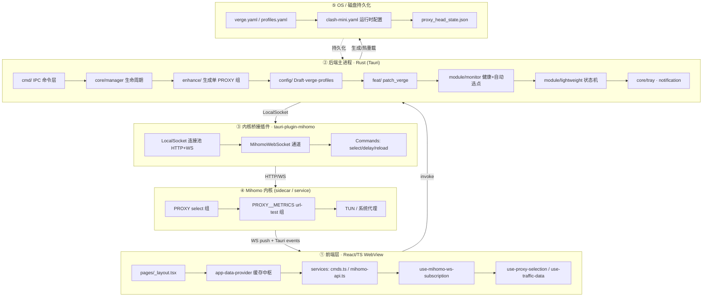
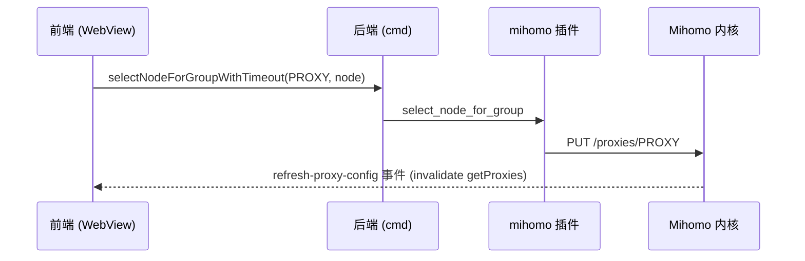

# Clash Mini 系统架构设计文档（整合版）

> 本文档是 Clash Mini 项目架构的**单一整合视图**，面向新接手者快速建立全局认知。
> 它不是新的规范，而是把散落在各处的设计文档收敛成一份可导航的架构索引：
>
> | 来源文档 | 角色 | 本整合文档如何引用 |
> |---|---|---|
> | `clash_mini_agreements.md` | **权威设计规范**（要做什么 / 为什么） | 第 5 节「关键设计决策」的契约来源 |
> | `docs/node-health-architecture.md` | 节点健康 / 故障转移子系统的**从零设计** | 第 3.2 / 5.1 / 5.2 / 5.3 的核心依据 |
> | `docs/ipc_optimization_proposal.md` | IPC 吞吐优化方案（差量更新 / 可见性门控） | 第 4.4 / 5.5 的依据 |
> | `docs/design-review-2026-07-21.md` | 设计书对照代码的**验证状态** | 第 8 节「设计验证状态」 |
> | `docs/implementation-notes.md` | 设计规则 → 代码标识的**备查索引** | 第 7 节「文件索引」与之互补 |
> | `clash_mini_pitfalls.md` | Agent 运行期**红线基本法** | 仅约束 AI 行为，不影响架构；见附录 |
>
> 阅读顺序建议：先第 1–2 节（模型与图），再第 3 节（模块），最后第 4 节（数据流）和第 5 节（决策）。

---

## 1. 技术栈与运行时模型

Clash Mini 是 **Tauri v2 混合桌面应用**，在原版 Clash Verge 基础上做了彻底的物理隔离与一套自有的控制/监测/轻量模式设计。

- **前端**：React 19 + TypeScript + Vite + MUI，状态层用 `@tanstack/react-query`（服务端状态）+ `foxact`（轻量上下文），无 Redux / zustand。
- **后端**：Rust（Tauri 命令层 + 内核生命周期 + 配置生成 + 监测守护线程），workspace 由 `src-tauri` 与若干 `crates/*` 组成。
- **内核**：**Mihomo (Clash.Meta)**，以 **sidecar 子进程**或 Windows **系统服务**形式运行，二进制名前缀 `mini-` 与原版 `verge-mihomo` 物理隔离。
- **内核通信**：专用 Tauri 插件 `tauri-plugin-mihomo`，通过**本地套接字**（Linux/macOS Unix socket，Windows 命名管道 `\\.\pipe\mini-mihomo`）以 HTTP + WebSocket 与内核交互，避免使用 raw TCP（external_controller 禁用时仍能通信）。
- **核心架构约定**：所有上游代理组被**折叠为唯一 `PROXY` 选择器组** + 一个隐藏的 `PROXY__METRICS`（url-test）测量组；几乎所有逻辑只碰 `PROXY`。

---

## 2. 系统架构图

分层（自上而下 = 控制流方向；自下而上 = 遥测/事件流方向）：

---

## 3. 分层与核心模块

### 3.1 前端层（React / TS WebView）

| 关注点 | 关键文件 | 说明 |
|---|---|---|
| 页面外壳 | `src/pages/_layout.tsx` | 主布局（~2400 行，下一阶段计划拆 hooks：useProfileManagement / useCoreUpdate / useSkinControl / useImportContextMenu） |
| 缓存中枢 | `src/providers/app-data-provider.tsx` | 拥有全部 react-query 缓存（代理 / 配置 / 规则 / 连接 / 系统代理 / 运行模式），监听 `profile-changed` 与 `verge://refresh-proxy-config` 事件并失效缓存 |
| IPC 封装 | `src/services/cmds.ts` | 每个后端 `invoke` 包 `withIpcTimeout`（如 `importProfile` / `patchVergeConfig` / `triggerAutoSelect` / `restartCore`） |
| 内核 API 封装 | `src/services/mihomo-api.ts` | 封装 `tauri-plugin-mihomo-api` 访客函数（带超时），如 `selectNodeForGroupWithTimeout` |
| 共享 WS 订阅 | `src/hooks/use-mihomo-ws-subscription.ts` | 通用共享 WebSocket 订阅管理器（重连 / 每 key 共享 socket / 节流 / 写入 react-query 缓存）；常驻遥测的唯一入口 |
| 专项 Hook | `use-proxy-selection` / `use-traffic-data` / `use-connection-data` / `use-proxy-delay-state` / `use-visibility` | 切节点、流量图、连接表、延迟、窗口可见性门控 |

**要点**：前端**不自行批量测速**——所有测速/选点委托后端，回传事件成为 UI 延迟数据的唯一来源（设计书 §5.6）。

### 3.2 后端主进程（Rust）

| 模块 | 路径 | 职责 |
|---|---|---|
| **IPC 命令层** | `src-tauri/src/cmd/` | 全部 `#[taui::command]`（`app.rs` `clash.rs` `core_update.rs` `lightweight.rs` `profile.rs` `proxy.rs` `runtime.rs` `service.rs` `verge.rs` …），注册于 `lib.rs` 的 `generate_handlers!` |
| **内核生命周期** | `src-tauri/src/core/manager/` | `CoreManager` 单例；`RunningMode`（Service / Sidecar / NotRunning）；`start_core`/`stop_core`/`restart_core`；Service vs Sidecar 决策；重启/热重载前后 `PROXY.now` 快照-恢复 |
| **配置生成（enhance）** | `src-tauri/src/enhance/` | `enhance()` 合并所有 profile 的 proxies/merge/script/rules + 全局 Merge/Script，最后 `enforce_mini_agreements` 把 proxy-groups 改写成 `[PROXY(select), PROXY__METRICS(url-test)]` 并注入 GFWList 规则 |
| **配置 / 状态** | `src-tauri/src/config/` | `Config` 单例（4 个 `Draft<T>` 已提交 vs 在途）；`IVerge` / `IProfiles` / `PrfItem` / `IClashTemp` |
| **特性编排** | `src-tauri/src/feat/` | `patch_verge`（用 `UpdateFlags` 位标决定重启内核 / 更新系统代理 / 刷新托盘 / 切语言）、`toggle_system_proxy` / `toggle_tun_mode` |
| **监测与自愈引擎** | `src-tauri/src/module/monitor.rs` | 长驻守护线程：正常 15s / 离线 5s / 重试 3s 周期；`evaluate_failover` 读 `PROXY__METRICS` 权威值；`trigger_backend_auto_select` 统一测速+选点；回写 `profile.selected`（三层防污染校验）；网络在线/离线探测；统一记账 `self_heal_with_accounting` |
| **轻量模式** | `src-tauri/src/module/lightweight.rs` | 三态 CAS 状态机（Normal / In / Exiting）+ 全局锁；进入时销毁主窗口、熔断前端 WS、不断用户连接；退出自动重连 |
| **托盘 / 事件** | `src-tauri/src/core/tray/` `src-tauri/src/core/notification.rs` | 极简静态托盘（禁动态更新图标防 `E_FAIL`）；`FrontendEvent` 枚举 + `Handle::notify_*` 向后端→前端 emit 事件（轻量模式静默丢弃） |

### 3.3 内核桥接插件（`tauri-plugin-mihomo`）

- **传输**：`crates/tauri-plugin-mihomo/src/ipc.rs` 用 `hyper` 客端经 `WrapStream` 走 Unix socket / 命名管道；`IpcConnectionPool`（默认 min 3 / max 20，空闲超时 60s + 健康检查 60s；默认拒绝策略 `New`：池满时直接新建连接而非阻塞等待）。
- **命令**：`update_controller` / `get_groups` / `select_node_for_group` / `delay_group` / `get_proxies` / `reload_config` / `flush_dns` / `ws_traffic` / `ws_memory` / `ws_connections` / `ws_logs` / `clear_all_ws_connections`。
- **WS 通道**：`MihomoWebSocket` 每通道一个，把内核 `/traffic` `/memory` `/connections` `/logs` 透传到前端（Rust 不反序列化，直接转发字节，序列化负担交给 V8）。
- **这是唯一与内核对话的边界**——后端其余部分不直接碰内核。

### 3.4 Mihomo 内核（sidecar / system service）

- **`PROXY`（select）**：用户/app 控制的出口选择，选择稳定、手动覆盖持久。
- **`PROXY__METRICS`（url-test）**：测量专用组，成员与 `PROXY` 完全相同，`interval`≈300s 周期性**直接拨测**每个成员的真实延迟，维护 `now`/`history`——这是延迟的**唯一权威源**，从测量层消除 TUN 自指回环。
- **运行模式**：TUN 开启 → 系统服务模式（UAC 安装/接管），否则旁路 sidecar；管理员运行时跳过服务等待。

### 3.5 OS / 磁盘持久化

基目录 `<data_dir>/io.github.clash-mini.clash-mini`（便携版为 `<exe>/.config/...` + `PORTABLE` 标志）。

| 文件 | 作用 | 代码引用 |
|---|---|---|
| `verge.yaml` | 应用设置（`IVerge`） | `config/verge.rs` |
| `profiles.yaml` | 订阅注册表（`IProfiles`） | `config/profiles.rs` |
| `clash-mini.yaml` | **实际喂给内核的运行时配置** | `config/config.rs::generate_file` |
| `proxy_head_state.json` | 每 profile 的 PROXY 组过滤/排序状态（子集语义） | `cmd/proxy.rs` / `monitor.rs` |
| `mini-mihomo.sock` / `\\.\pipe\mini-mihomo` | 内核 IPC 套接字 | `ipc.rs` |

---

## 4. 数据流

### 4.1 手动切节点（零断流热切换）

> 全程只是 `PUT /proxies/{group}`，**不整份 reload、不触发 `auto_close_connection`**，故进行中连接不断（用户铁律）。

### 4.2 自动选点 / 导入订阅 / 轻量唤醒（统一走 monitor）

1. 触发源：`trigger_auto_select` 命令、导入 profile（`import_profile` → `enhance_profiles` 重新生成 `clash-mini.yaml` → `reload_config`）、轻量进入/唤醒。
2. `monitor::trigger_backend_auto_select` → `mihomo.delay_group("PROXY__METRICS")` → 内核级 url-test 拨测。
3. 在**传入的可见子集 / 全量子集**内挑最快健康节点 → `select_node_for_group("PROXY", 最快)`。
4. 写回 `profile.selected`（**先按候选快照校验范围**，越界不写回）；通过 `Handle::notify_delay_results` 发 `verge://backend-delay-results` 给前端。

### 4.3 配置生成与下发（patch → enhance → reload）

- UI `patchVergeConfig` → `invoke('patch_verge_config')` → `feat::config::patch_verge`（`UpdateFlags` 决定重启 / 热更系统代理 / 刷新托盘）。
- `CoreManager::update_config_checked` → `enhance::enhance()` 重新组装 → `Config::generate_file` 写 `clash-mini.yaml` → `mihomo.reload_config(true, path)`（热重载）或 `restart_core`。
- 重启/热重载路径均对 `PROXY.now` 做快照-恢复，避免被重置成广告假节点（设计书 §7.1）。

### 4.4 遥测回传（推而非轮询）

- **常驻实时流**：`/traffic` `/memory` `/connections` `/logs` 四条 WebSocket，由 `tauri-plugin-mihomo` 透传，前端经 `use-mihomo-ws-subscription` 节流写入 react-query 缓存。
- **一次性读取**：proxies / groups / rules / providers / delays 走普通 `invoke` → 本地套接字 HTTP。
- **控制事件**：后端→前端经 Tauri 事件（`profile-changed`、`verge://refresh-proxy-config`、`verge://backend-delay-results`、`verge://notice-message`），`app-data-provider` 监听后失效缓存。

### 4.5 轻量模式的数据流差异

进入轻量：`clear_all_ws_connections()` 熔断所有前端 WS 常驻订阅（CPU/内存归零），**已建立的真实网络连接不断**；后台 `monitor` 继续 15s 周期监测。退出轻量：主窗口重建时 React 挂载逻辑自动重发 WS 建立指令，数据无感瞬连。

---

## 5. 关键设计决策整合（契约摘要）

> 以下为设计书核心契约的收敛，逐条可在 `clash_mini_agreements.md` / `node-health-architecture.md` 找到依据。

### 5.1 测量归内核 · 双组解耦（治本地基）
`PROXY=select` + `PROXY__METRICS=url-test` 把"控制"与"测量"彻底解耦：手动选点持久、测量又可靠，且**在 TUN 下无自指回环**（旧设计在 TUN 下"测活跃节点自身返回 timeout"的根因被从测量源消除）。

### 5.2 子集结构性 · 三层防污染校验
地域过滤（`filterText`）同时重配两组的 membership，池外节点在配置层即不可能出现（结构性越界不可能）。选点回写 `profile.selected` 前校验节点在范围、轻量还原前再校验、前端反向校准第三道——闭环了 2026-07-19 污染事故。

### 5.3 热切换零断流（禁 reload）
故障转移一律 `select`（干净热切换），禁整份 `refresh_clash()` + `auto_close_connection`，断连风暴从结构上不可能。

### 5.4 手动优先 · 自愈仅兜底
- 周期：**正常在线 15s**、**离线 5s**（快速探测网络恢复）、**重试 3s**（前台/后台/轻量统一由同一常驻线程驱动，节奏一致）。
- 连续 **2 次**失败才触发批量自愈；自愈失败 **60s** 冷却；连续 **5 次**失败弹 Windows 警报。
- 内核 API 连续 **3 次**异常也触发一次自愈（旧代码静默 debug 导致内核卡死时监测失效，已修）。
- 三处自愈路径统一走 `self_heal_with_accounting` 记账，禁止裸 `trigger_backend_auto_select` 绕过冷却。

### 5.5 IPC 优化（高负载下的吞吐治理）
- **差量更新协议（Delta Push）**：`/connections` 首帧发全量 Snapshot，之后只发 `added/updated(扁平数组)/removed`，带 `epoch_id`+`sequence_id` 校验，60s 或 100 帧重同步一次；把 15s 内 38MB+ 降到 ~1.25MB（1k 连接）/ ~2.64MB（2.5k 连接）。
- **窗口可见性门控**：仅当窗口最小化/隐藏（非单纯失焦）超过 1s 才断 WS + `clear_all_ws_connections`；恢复时先 REST 预取再 WS。
- **节流与日志批处理**：连接表 1–2s 节流、流量图 3s、日志 50 条/250ms 批处理（Error 立即 flush）。

> 注：以上吞吐数值（38MB→~1.25MB 等）与节流节奏为 `ipc_optimization_proposal.md` 的**设计目标**，代表优化方向而非运行时实测值。

### 5.6 轻量模式状态机
三态 CAS（Normal / In / Exiting）+ 全局锁 + 失败回滚；进入销毁主窗口、熔断 WS、不断用户连接；退出自动重连。窗口尺寸"进入存盘、唤醒读回套用"。

### 5.7 隔离与健壮性（与原版并存）
- 命名/端口/进程前缀 `mini-` 物理隔离；单实例端口 33335(Release)/33336(Dev)；Mixed 10801 / Controller 9098。
- 安全：权限最小化（删 shell 执行权限、FS 收窄到应用目录、HTTP 域名白名单）、SSRF/Zip-Slip 防护、JS 引擎原型链冻结沙箱、`overflow-checks=true`、YAML ≤50MB。
- 内核内存约束（均读取自环境变量，可被部署配置覆盖）：`GOMEMLIMIT` 默认 `128MiB` / `GOGC` 默认 `100` / `GOMAXPROCS=2`（代码中无 96MiB/50 的硬编码；`geodata-loader` 在应用代码中未发现设置）。

---

## 6. IPC 接口速查

### 6.1 前端 → 后端（部分关键 invoke）
`getProfiles` / `importProfile` / `enhanceProfiles` / `patchVergeConfig` / `patchClashConfig` / `triggerAutoSelect` / `restartCore` / `getRunningMode` / `installService` / `entryLightweightMode` / `exitLightweightMode` / `saveProxyHeadState` / `getClashLogs` / `checkMediaUnlock`。

### 6.2 后端 → 内核（mihomo 插件命令）
`select_node_for_group` / `delay_group` / `get_proxies` / `get_groups` / `reload_config` / `flush_dns` / `ws_traffic` / `ws_memory` / `ws_connections` / `ws_logs` / `clear_all_ws_connections`。

### 6.3 后端 → 前端（Tauri 事件）
`profile-changed` · `verge://refresh-clash-config` · `verge://refresh-verge-config` · `verge://refresh-proxy-config` · `verge://backend-delay-results` · `verge://notice-message` · `verge://timer-updated`。

---

## 7. 文件索引（where to look）

| 你想了解 | 看这里 |
|---|---|
| 内核启动/停止、Service vs Sidecar | `src-tauri/src/core/manager/lifecycle.rs` |
| 最终配置组装（单 PROXY 组） | `src-tauri/src/enhance/mod.rs`（`enforce_mini_agreements`） |
| 健康 / 自动选点引擎 | `src-tauri/src/module/monitor.rs` |
| 轻量模式 | `src-tauri/src/module/lightweight.rs` |
| 后端→前端事件 | `src-tauri/src/core/notification.rs` |
| 前端数据中枢 | `src/providers/app-data-provider.tsx` |
| 实时 WS 管线 | `src/hooks/use-mihomo-ws-subscription.ts` |
| 内核客户端（HTTP+WS 本地套接字） | `crates/tauri-plugin-mihomo/src/{lib,ipc,mihomo,commands}.rs` |
| 设计契约（权威） | `clash_mini_agreements.md` |
| 健康子系统深设计 | `docs/node-health-architecture.md` |
| IPC 优化深设计 | `docs/ipc_optimization_proposal.md` |
| 设计书对照代码验证 | `docs/design-review-2026-07-21.md` |
| 设计规则→代码标识 | `docs/implementation-notes.md` |

---

## 8. 设计验证状态（评审于 2026-07-21，基线 v2.6.9；当前代码版本见 `package.json` = 2.7.0）

总体结论：**地基正确、核心落地、图纸与代码存在少量脱节但已对齐**。

- ✅ 已落地的治本设计：双组解耦、热切换零断流、三层防污染校验、轻量状态机、主线程纪律、事件双过滤 + poison-tolerant 锁 + Drop Guard。
- 🔴 3 项曾为高优先真实风险（均在评审后已修并已提交）：① 手动切节点后高亮停旧节点（`47aa63c8`）；② `proxy_head_state.json` 非原子写（`159a4fe9`）；③ 进入轻量 `destroy_main_window` oneshot 无超时（`4b566b72`）。
- 🟡 监测控制逻辑三件套（周期恒定、内核全死计数、冷却记账统一）已修并收口到 `self_heal_with_accounting`。
- 设计书脱节条目已对齐：§4.3/§5.1 周期改为"恒定 15s"；§5.5 改为"选点限定子集、测速覆盖全量"；删除 §5.1 实现级编码规范（设计书不写编码规范）。

> 详细逐项带文件:行号见 `docs/design-review-2026-07-21.md`。本整合文档只做诊断汇总，未改任何代码。

---

## 9. 维护说明

- 本文件是**整合视图/导航**，不是新规范。改行为契约请改 `clash_mini_agreements.md`；改某子系统深设计请改对应 `docs/*.md`，并保持 `implementation-notes.md` 的代码索引同步。
- 架构图见同目录 `ARCHITECTURE.svg`（也可在本文第 2 节内联 Mermaid 查看）。
- 术语约定：本项目中"子集"= 前端按地域名过滤后可见的节点集合，选点/防断流只允许在子集内（详见 §5.2）。
